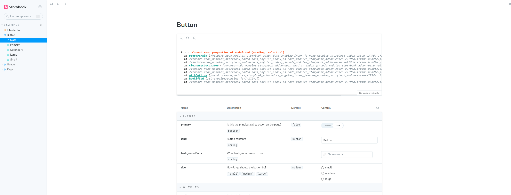

# Storybook #14828 Reproduction

This project is built as a reproduction of [issue #14828](https://github.com/storybookjs/storybook/issues/14828) based on the [reproduction instructions](https://github.com/storybookjs/storybook/issues/14828#issuecomment-1523875596) provided by [@John-Zimmer](https://github.com/John-Zimmer).

## Error Details



``` bash
Error: Cannot read properties of undefined (reading 'selector')
  at prepareMain (/vendors-node_modules_storybook_addon-docs_angular_index_js-node_modules_storybook_addon-essen-e279da.iframe.bundle.js:69199:82))
  at /vendors-node_modules_storybook_addon-docs_angular_index_js-node_modules_storybook_addon-essen-e279da.iframe.bundle.js:69185:17
  at /vendors-node_modules_storybook_addon-docs_angular_index_js-node_modules_storybook_addon-essen-e279da.iframe.bundle.js:69179:14
  at cleanArgsDecorator (/vendors-node_modules_storybook_addon-docs_angular_index_js-node_modules_storybook_addon-essen-e279da.iframe.bundle.js:69228:10))
  at /vendors-node_modules_storybook_addon-docs_angular_index_js-node_modules_storybook_addon-essen-e279da.iframe.bundle.js:69178:28
  at /vendors-node_modules_storybook_addon-docs_angular_index_js-node_modules_storybook_addon-essen-e279da.iframe.bundle.js:69179:14
  at withOutline (/vendors-node_modules_storybook_addon-docs_angular_index_js-node_modules_storybook_addon-essen-e279da.iframe.bundle.js:68027:43))
  at hookified (/sb-preview/runtime.js:7:17241))
  at /vendors-node_modules_storybook_addon-docs_angular_index_js-node_modules_storybook_addon-essen-e279da.iframe.bundle.js:69178:28

```

## Requirements

This bug is *potentially* caused by using NPM 7 as the error seems to be resolved when using the `--legacy-peer-deps` flag with NPM. As such, **please ensure you are using `npm 7.0+` when running this project to ensure consistent reproduction.**

## 👷‍♂️ Running the project

Clone the project to local:

``` bash
git clone https://github.com/computergnome99/storybook-14828-repro.git
```

Open the project and install dependencies:

``` bash
cd storybook-14828-repro;
npm install
```

Run Storybook:

``` bash
npm run storybook
```

## 👿 To see issue

Navigate to the `./project/example-lib` dir and install deps:

``` bash
cd ./project/example-lib;
npm install
```

Navigate back to top-level dir and run Storybook:

``` bash
cd ../../;
npm run storybook
```

## 😇 To resolve issue

Remove `node_modules` directory from `example-lib`:

``` bash
rm -rf ./projects/example-lib/node_modules
```

Run Storybook again:

``` bash
npm run storybook
```

### Alternate

If dependencies are required in the library project (as an example - not required for this project), you can install dependencies with the `--legacy-peer-deps` flag:

Ensure `node_modules` directory is removed from `example-lib`:

``` bash
rm -rf ./projects/example-lib/node_modules
```

Install dependencies in `example-lib` with `--legacy-peer-deps` flag:

``` bash
cd ./project/example-lib;
npm install --legacy-peer-deps;
cd ../../
```

Run Storybook again:

``` bash
npm run storybook
```

## Conclusion

It does appear that this error is the result of installing dependencies inside the library application using `npm 7+`.

I hope this reproduction was helpful.